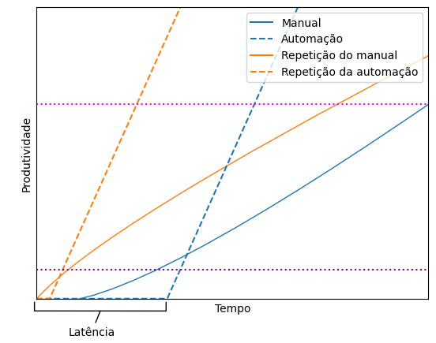
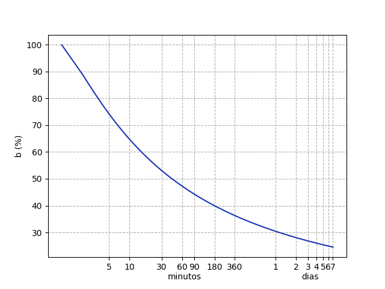
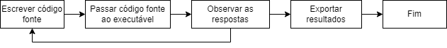

---
jupytext:
  cell_metadata_filter: -all
  formats: md:myst
  text_representation:
    extension: .md
    format_name: myst
    format_version: 0.13
    jupytext_version: 1.14.6
kernelspec:
  display_name: CursoPython
  language: python
  name: cursopython
---

# Introdução

Este curso tem como alvo alunos de graduação, pós-graduação e doutores que nunca programaram e estão interessadas em utilizar programação para resolver problemas científicos. Será fornecida uma introdução a temas básicos e serão apresentados alguns problemas para fixação de conteúdo. Como meu próprio *background* é em química, os exemplos mostrados aqui estarão mais focados nessa área, pois ciência é praticamente fractal, e é impossível colocar exemplos de todos os sub-campos. A linguagem selecionada é Python, que é muito utilizada na área.

Este curso é armazenado publicamente em [meu Github](https://github.com/KarlClinckspoor/CursoPython), no formato de vários Jupyter Notebooks e arquivos Myst Markdown, como também consolidado em um livro online em html e pdf, criados por Jupyter Book.

## Sobre ferramentas e programação

Para fazer ciência, precisamos de ferramentas. Computadores tornaram-se ubíquos em todas as áreas da ciência, e há uma variedade infindável de programas feitos para nos ajudar (e algumas vezes atrapalhar). Eu gosto bastante de procurar programas que me auxiliam em diversas tarefas, como realizar anotações (Zettlr), administrar bibliografia (Zotero), dentre outras. Para o tratamento de dados, os programas mais comumente utilizados, em minha experiência na área da Química, são Excel e OriginPro, que utilizei e continuo utilizando em menor escala.

A maneira mais flexível de interação com um computador é por meio da programação que, bem resumidamente, se resume em escrever uma série de comandos que serão fornecidos a um programa que irá executar as ações desejadas no computador. A programação no meio científico é uma ferramenta bastante poderosa para auxiliar, dentre outras coisas, no tratamento de dados. Algumas linguagens utilizadas no campo científico são:

* [Python](https://www.python.org/) (foco deste curso)
* [Julia](https://julialang.org/) (focada em maior performance)
* [R](https://www.r-project.org/) (focada em estatística)
* [MATLAB](https://www.mathworks.com/products/matlab.html) (focada em operações matriciais. Possui uma das melhores ajudas de qualquer linguagem, e uma coleção de pacotes extremamente úteis)
* [Octave](https://octave.org/index), alternativa open-source ao Matlab.
* [Mathematica](https://www.wolfram.com/mathematica/) (focada em pesquisa matemática)
* [Maple](https://www.maplesoft.com/products/Maple/) (focada em pesquisa matemática)

Uma linguagem de programação é somente uma ferramenta. Não faz sentido defender uma ferramenta frente à outra, sem conhecer o contexto da tarefa e da pessoa. *A tarefa dita a ferramenta que precisa ser utilizada*. Se Python não for uma boa escolha para a tarefa, busque outra ferramenta. Não seja extremista.[^1]. Eu, pessoalmente, me especializei em Python pois é uma linguagem genérica, e me permite realizar outras tarefas sem necessitar aprender uma linguagem nova. Não é a língua perfeita para tudo, mas é capaz o suficiente para resolver muitos problemas. E, ao utilizar Python para tratamento de dados, achei que os resultados ficaram mais organizados e reprodutíveis, e consigo ser mais flexível em minhas análises. Acredito que ploto dezenas a uma de gráficos antes de encontrar um que me satisfaz, algo que seria bastante oneroso se feito com as ferramentas tradicionais[^2].

[^1]: Não tolerarei *flamewars* sobre linguagens.
[^2]: Excel e OriginPro possuem maneiras de automatização. O primeiro pode ser automatizado por [VBA](https://learn.microsoft.com/pt-br/office/vba/library-reference/concepts/getting-started-with-vba-in-office) e [TypeScript](https://learn.microsoft.com/en-us/office/dev/scripts/develop/scripting-fundamentals) na versão web, e o [segundo possui várias interfaces com outras linguagens, inclusive Python](https://www.originlab.com/doc/Programming). Nunca me aprofundei em nenhum dos dois, mas podem ser ferramentas poderosas se utilizadas corretamente.

Algumas características positivas e negativas sobre utilizar programação num contexto científico são:

* *Pode* poupar muito tempo, como também *pode* ser perda de tempo
* *Pode* permitir realizar várias análises num conjunto de dados
* *Pode* permitir trocar algum parâmetro de análise facilmente, e todos os *outputs* se refazerem.
* *Pode* permitir padronizar formatos de gráfico e métodos de tratamento de dados
* *Pode* ser uma maneira mais legível para o registro de atividades que, p.e., uma planilha do Excel ou um projeto do OriginPro mas vai depender da sua capacidade de organização também.
  * O problema do Excel e do Origin é que são essencialmente não-lineares. Um script, necessariamente, é executado de "cima para baixo". Porém, se você não tiver o cuidado necessário, jupyter notebooks podem ter um pouco desta não-linearidade. Vamos abordar isso no curso.
* *Pode* ser uma atividade divertida, mas *pode* também ser bastante frustrante. Diversão é um tema estranho de ser abordado, mas eu acredito que poder fazer uma tarefa sem precisar morrer de tédio é um bonus considerável.
* Pacotes são geralmente gratuitos e de código aberto. Isso pode-lhe permitir realizar tarefas que outros teriam que lidar com softwares pagos (ou pirataria). Por outro lado, muitas vezes tais pacotes são menos documentados e mais difíceis de se usar do que algumas soluções pagas, então a utilidade final irá depender do tempo disponível para aprender e da quantidade de dados a serem tratados.
* Dependendo da tarefa, não há softwares para resolvê-la, então você precisa se virar para criar algo sozinho, ou encomendar a tarefa.
* Dependendo de quem é seu chefe, automatizar uma tarefa, incluir uma interface simples, pode fazer o olho dele(a) brilhar. Porém, a recompensa por realizar suas tarefas algumas vezes é *mais tarefas* então considere também ficar em silêncio sobre sua crescente produtividade.

Para exemplificar o que quero dizer sobre poupar tempo, criei este gráfico nada científico, mostrando o que quero dizer. Neste plot eu tento resumir a minha percepção sobre a "produtividade" comparativa entre um trabalho manual e o mesmo trabalho que foi realizado programaticamente.



Os primeiros passos em qualquer tarefa são exploratórios. Descobre-se como carregar um dado, como fazer uma análise, como representar o resultado de maneira apropriada. É uma etapa altamente experimental. O tempo gasto nessa etapa representei aqui como "Tempo de latência". Depois que chegamos a uma metodologia, a mesma é repetida para o resto do conjunto de dados. Geralmente, o tempo de latência é maior para uma tarefa programática devido a sua inerente complexidade.

As curvas azuis representam está sendo realizado pela primeira vez. O tempo de latência da tarefa manual é menor que na tarefa programática, e os primeiros resultados começam a aparecer antes. Porém, assim que um script é finalizado, a produtividade cresce rapidamente. De fato, o crescimento aqui deveria ser quase que vertical. A curvas em laranja representam uma situação onde a análise precisou ser refeita (erro nas premissas, ou outro conjunto de dados). O tempo de latência é muito menor pois já existe a experiência/código anterior[^3]. 

[^3]: Note que presumiu-se que não foi necessário re-lembrar o procedimento ou re-interpretar o script criado, que aumentaria em muito o tempo de latência. Em metodologias de tratamento intrinsecamente não-lineares (Excel, Origin), o tempo de latência pode ser muito grande comparado a uma metodologia geralmente linear (scripts). Quem nunca herdou uma planilha do Excel absolutamente impenetrável?

Uma tarefa de baixo volume (linha pontilhada em roxo), não é muito beneficiada pela automatização inicialmente, pois a linha pontilhada cruza a linha contínua azul antes da linha tracejada. Porém, se a tarefa precisa ser re-feita (curvas laranja), como a execução programática é muito mais rápida que a manual, ganha-se muito tempo. Caso o volume de tratamento seja maior ainda (linha pontilhada magenta), utilizar a programação é benéfico em qualquer situação, no sentido de gasto de tempo.

A seguir irei mostrar alguns exemplos onde a programação foi útil para mim, como motivação para você, e irei citar o tempo de latência estimado para cada uma.

## Exemplos de situações onde programar foi útil para mim.

1. Uma amiga possuía um grande conjunto de curvas força-distância de AFM, e desejava obter a força necessária para a liberação da ponteira. Ela estava utilizando o OriginPro. Primeiro plotava, colocava o cursor sobre o ponto mínimo e depois sobre o ponto de liberação, anotava os valores numa planilha, e continuava para o próximo dado. Não só era impreciso, mas muito entediante. Eu era relativamente amador e consegui fazer um script para tratar todos os dados dela em menos de 1 hora.
2. Eu me deparei com uma quantidade grande de dados de reologia de um projeto que participei. Cada arquivo específico possuía 3 curvas, em sequência, cada curva utilizava colunas diferentes do arquivo. Precisava remover pontos espúrios, fitar modelos em cada seção, plotar tudo e retornar uma tabela. Essa tarefa demoraria dias para realizar manualmente, mas consegui realizar tudo em uma tarde. Depois notei um erro e re-tratei tudo em 15 minutos.
3. A segmentação é uma das primeiras etapas durante o tratamento de dados de tomografia médica para análise de rochas. Possuíamos um procedimento para amostras consolidadas, mas depois recebemos amostras com grandes buracos e o procedimento não era mais válido. Tornou-se necessário realizar a segmentação semi-manual, que demorava cerca de 10 minutos de trabalho monótono (com uma automação para acelerar) e altamente dependente do analista, o que nunca é muito desejado. Passei dois períodos pensando e escrevendo um script em Python que conseguia fazer a segmentação em 30 segundos por aquivo.
4. Ainda no tema de tomografia, o protocolo completo de tratamento que utilizávamos possuía várias etapas, algumas bastante demoradas por conta da carga de cálculos envolvidos. O software possuía uma interface em Python para automação e outra em MATLAB para cálculos. Otimizando a segmentação e automatizando o processo (Python) e aprimorando os cálculos (MATLAB), o procedimento passou de 1 dia por amostra para 10 amostras por dia. E melhor, a maior parte do tempo ficava ocioso, aproveitando o YouTube, então o dia passava muito rápido e sem estresse. Gastei no total 2-3 dias aprendendo a interface de automação e enxugando o código de MATLAB, e ganhei praticamente semanas de tempo.
5. Uma vez, precisávamos realizar experimentos ao longo de horas utilizando um equipamento de RMN de baixo campo. O equipamento não possuía a funcionalidade para isso. Escrevi um script utilizando pyautogui que clicava os botões no software do equipamento para realizar as medidas e conseguimos, então, realizar as medidas durante a noite. Depois, fiz outro script para automatizar o tratamento dos dados no mesmo software, que também não possuía a funcionalidade de tratamento em batelada. Gastei no máximo 1 tarde para fazer ambos os scripts e ganhamos várias madrugadas.
6. Consegui meu primeiro emprego após a pós-graduação porque possuía conhecimentos em Python, que foi considerado um diferencial.

## Sobre como aprender a programar

Programação geralmente requer uma abordagem diferente. É necessário seguir à risca as regras da linguagem, memorizar muita coisa, como sintaxe, palavras chave, conteúdo de pacotes, técnicas de abordagem, e o conteúdo precisa ser criado *do zero*. É uma atividade altamente criativa, e o código criado por duas pessoas com a mesma finalidade pode variar significativamente. Não há uma interface simples para explorar o conteúdo, por exemplo, do *scipy*. Alguns dos conceitos utilizados não são comumente encontrados em outros contextos, como *recursão*, e podem ser complicados de se entender. A chave para aprender tudo isso é esforço, repetição e treino, não há escapatória.

Felizmente há ferramentas disponíveis para auxiliar no aprendizado de programação (de qualquer tema, realmente). Neste curso, utilizarei várias passagens do livro *The programmer's Brain*, de Felienne Hermans, para fornecer dicas de aprendizado e mostrar como nosso cérebro funciona na hora de aprender e resolver problemas.

Por exemplo, a curva do esquecimento de Ebbinghaus mostra o quanto conseguimos reter de certa informação com o tempo:

 

Note que cerca de algumas horas após aprender alguma coisa, já é capaz de termos esquecido 60% da informação. Porém, a repetição espaçada (com um espaçamento adequado, como 1 dia, 1 semana e 1 mês) pode permitir-lhe relembrar de informação com maior eficiência, pois torna a curva de Ebbinghaus menos abrupta. 

Se você já têm experiência com outras linguagens, aprender uma nova é, geralmente, muito mais fácil, pelo processo de transferência positiva. Se tiverem curiosidade, procurem depois por APL, Lisp e Haskell para verem algumas abordagens diferentes a Python.

Um fator que pode dificultar o aprendizado é a mudança de perspectiva necessária para resolver os problemas da maneira que a linguagem permite. Isso vale para outras áreas também.[^4] Problemas em programação são frequentemente resolvidos da seguinte maneira: subsivisão do problema em partes cada vez menores e mais simples, resolver os mini-problemas, depois montar tudo de volta.

[^4]: Por exemplo: Suponha que há um trêm saindo de Campinas e indo a São Paulo, a 100 km de distância, e outro trêm indo na direção oposta e partindo no mesmo horário. Ambos os trêns avançam na velocidade de 25 km/h. Uma andorinha vai e volta entre os trêns, partindo de Campinas, e voa a 50 km/h. Qual será a distância total percorrida pela andorinha quando os trêns se encontrarem? Uma solução inicial seria modelar as velocidades e posições dos três objetos e resolver o conjunto de equações envolvidas. Porém, se você notar que os trêns se encontram em 2 horas, no meio do caminho, sabemos que a andorinha teve que percorrer 100 km, pois voou continuamente por 2 horas.

## Por que Python?

Python ganhou muita popularidade em tempos recentes com o boom da inteligência artificial, aprendizado de máquina e ciência de dados. É uma uma linguagem acessível, gratuita, multi-paradigma, multi-plataforma, com uma sintaxe clara, e sem grandes complicações com o sistema de tipos. Possui uma quantidade grande de pacotes gratuitos, para uma enorme variedade de finalidades, e funciona muito bem como uma linguagem de junta várias outras.

Além disso, é uma das linguagens mais populares entre aqueles que estão aprendendo a programar, e popular também entre programadores mais experientes [fonte](https://survey.stackoverflow.co/2022/#most-popular-technologies-language-learn), atrás somente de linguagens voltadas à web (p.e. Javascript). Possui uma grande comunidade de suporte e muita gente trabalhando para que sempre melhore.

Porém, não é uma linguagem sem falhas. Tarefas com uma alta necessidade de performance vão requerer abordagens diferentes, pois podem ser muito lentas em Python. Porém, há várias alternativas para contornar isso, como [Cython](https://cython.org/), [Numba](https://numba.pydata.org/) e [extensões para C e C++](https://docs.python.org/3/extending/extending.html). Porém, para as finalidades científicas cotidianas, é plenamente viável. Note também que o seu tempo é mais valioso que o tempo do computador. Uma tarefa demorar 3 segundos para ser executada em Python vs 3 millisegundos em C++ é, para nós, plenamente aceitável, visto que o tempo necessário para escrever o código em Python é significativamente menor (contanto exploração e compilação).

## Fluxograma de trabalho com Python

A maneira para trabalhar com Python é a seguinte:

1. Escrever código em um arquivo de texto (p.e. extensão `.py`).
2. Enviar texto para o executável (`python.exe`)
3. Avaliar o resultado. Não está bom? Volta a escrever
4. Se está bom, exportar os resultados se necessário

Que pode ser resumida neste .

Para um trabalho científico, que é muito iterativo e exploratório, esse fluxograma é inconveniente, porque o "estado do sistema" é sempre reconstruído quando o arquivo de texto é passado ao executável, isto é, todos os comandos são executados mesmo se você fizer uma mudança pequena.

Porém, python possui um "interpretador interativo" (REPL - **R**ead **E**valuate **P**rint **L**oop), que mistura as etapas 1 e 2 do fluxograma, que permite-lhe explorar a linguagem e realizar qualquer tarefa em tempo real, preservando o estado do sistema. Isso o torna ideal para análises exploratórias de dados.

Porém, utilizar o REPL torna-se rapidamente inconveniente se a edição de texto for minimamente mais complexa que uma função simples, e também se você desejar replicar os comandos executados outro dia. Uma ferramenta foi desenvolvida que mescla um editor de texto com o REPL, e foi batizado *Jupyter notebook* (em homenagem a **Ju**lia, **Pyt**hon e **R**), que será muito utilizado neste curso. O arquivo notebook é organizado em células, que podem conter tanto texto ou código, e cada célula de código possui um espaço para o *output* do código, como texto, gráficos ou tabelas. A desvantagem deste tipo de arquivo é que *pode* introduzir mais hábitos de programação, e a reutilização de código se torna inconveniente. Não é impossível, mas é complicado importar arquivos notebook em outros arquivos.

Neste curso, ambos os métodos serão abordados. Jupyter notebooks para análise exploratória, arquivos .py e pacotes para consolidação.

## Instalação e uso de Python

```{note}
Minha **recomendação pessoal** é a instalação local com Anaconda, ou Thonny para as primeiras aulas, seguido de Anaconda.
```

### Instalação local

A instalação local é mais trabalhosa para fazer funcionar, mas é mais rápida e mais customizável que as soluções on-line. Recomendo.

* Utilizando o instalador do [site oficial](https://www.python.org), versão 3.11 ou mais recente.
* Utilizando o instalador [Anaconda](https://www.anaconda.com/download/) (ou [miniconda](https://docs.conda.io/en/latest/miniconda.html))
  * Pacote voltado para ciência de dados. Já vem com vários pacotes pré-instalados e um gerenciador de pacotes próprio, o conda, que é mais poderoso que o nativo, pip. Não precisam de permissão de administrador.
  * Anaconda vem com várias coisas extras que podem ser úteis para você. Miniconda é mais recomendado se você só quer uma instalação básica e irá criar seus ambientes depois. Para este curso, o Anaconda é mais recomendado.
* Utilizando [Thonny](https://thonny.org/), um editor que já vem com sua instalação python própria.

### Ferramentas online

Existem várias ferramentas para a execução online de scripts e notebooks. Uma das maiores desvantagens é a relativa chateação para subir os seus arquivos para serem acessíveis às ferramentas. Se você possuir muitos arquivos, ou forem muito grandes, não conseguirá utilizar essas ferramentas convenientemente.

* Online, baseados em arquivos `.py`
  * https://replit.com/ - Tem planos gratuitos para criar alguns projetos. Funciona a base de arquivos .py e não de notebooks. Bastante lento na minha opinião, não servirá para muitas coisas além do mais básico do começo.
  * https://www.online-python.com/ - Este é OK para o começo, mas quando avançarmos a temas mais relevantes, principalmente quanto tivermos que utilizar pacotes científicos, é melhor utilizar outras opções.
* Online, baseado em jupyter notebooks
  * Google Colab - ferramenta padrão para notebooks online.
  * JetBrains Datalore - tem planos gratuitos para iniciantes.
  * [Jupyter Lite](https://jupyter.org/try-jupyter/lab/)

### Primeiro script, para verificar se tudo está correto.

1. Inicie uma instância do REPL ou um novo notebook.
  * Python puro: abra um `shell` digitando na barra de pesquisa `cmd` ou `powershell`, clique no ícone, depois digite `python`, aperte Enter.
  * Anaconda (miniconda): Em iniciar, encontre o `Anaconda Prompt` e clique, digite `python`, aperte Enter.
  * Thonny: Abra o editor.
  * Nuvem: crie um novo notebook, e depois uma célula no notebook.
2. Escreva o seguinte código:

```python
print("Hello world!")
```

3. Aperte Enter (ou Shift+Enter nos notebooks). Se a mensagem `Hello world!` aparecer logo em seguida, tudo está funcionando direito.
4. Se, ao digitar `python` no `shell` e aparecer um erro de que o comando não foi encontrado, você possui um problema na variável `PATH` de ambiente. Siga [este](https://realpython.com/add-python-to-path/) tutorial caso isso ocorra.

### Com o que escrever scripts Python

No caso de scripts e notebooks locais, existem três níveis de complexidade para os softwares de edição de código:

* Editores de texto simples (bloco de notas), mas não é recomendado, pois faltam várias características desejadas.
* Editores de texto avançados, como **Thonny**, Visual Studio Code, Sublime Text, Spyder. São mais avançados, possuem ferramentas para autocompletação de código e realce de linguagem. **Visual Studio Code** é muito famoso e certamente o mais popular de todos citado aqui. VSCode possui suporte nativo a jupyter notebooks, mas os outros não possuem nenhum suporte. Spyder vem instalado com o pacote `Anaconda` e é voltado à computação científica e ciência de dados.
* Jupyter lab, uma ferramenta para o navegador que permite editar notebooks e arquivos .py em uma variedade de linguagens, desde que configurado corretamente. Já vem instalado no pacote `Anaconda`, e pode ser iniciado com o comando `jupyter lab` no shell.
* IDEs (Integrated Development Environment) como **PyCharm** Community Edition (quem possui email educacional pode solicitar uma licença para a versão Professional gratuitamente) e Visual Studio. Possuem muitas ferramentas que auxiliam muito na elaboração de projetos mais complexos. Pecam no suporte para Jupyter Notebooks e computação científica de forma geral.

Minha recomendação pessoal é começar com editores avançados até aprender bem os fundamentos da linguagem. Quando quiser desenvolver projetos mais complexos, passar para IDEs. Selecione qualquer um dessas ferramentas, crie um novo arquivo chamado `hello_world.py` e coloque o código que utilizamos anteriormente como teste:

```python
print("Hello world!")
```

### Como rodar scripts Python

Para rodar um script, é necessário ter o executável Python (`python.exe`) com os pacotes necessários acessíveis pelo executável. O executável pode estar tanto no seu computador, como na rede ou na nuvem. A opção mais fácil é utilizar ferramentas da nuvem, mas há uma série de restrições e chateações quando se faz isso, começando pela lentidão e complicação para colocar seus dados junto da nuvem. Instalar localmente é, de forma geral, a maneira mais robusta de se utilizar a ferramenta.

É necessário ter algum conhecimento de **linha de comando** para utilizar python e as ferramentas. Os *shells* comumente utilizados em Windows são `cmd.exe` e `powershell.exe`. Felizmente, os comandos que precisam ser utilizados frequentemente são poucos e simples. Os comandos específicos para cada programa serão abordados em suas respectivas seções. Aqui vai uma lista básica dos comandos para os shells do Windows.:
* `cd <dir>` muda o diretório para `<dir>`. Por exemplo: `cd Downloads`, `cd ..` (`..` significa o diretório pai).
* `dir` (ou também `ls` no powershell) lista os arquivos na pasta atual.
* `explorer .` abre uma pasta do explorer no diretório atual (`.` significa diretório atual). Assim, tarefas mais complexas como criar pastas, renomear arquivos, etc, podem ser feitas pelo explorer.

Suponha que você está na pasta `C:\` e deseja rodar o arquivo `analysis.py` em `C:\Scripts`. Para isso, utilize os seguintes comandos:

* `cd ./Scripts`
* `python ./analysis.py`

Note que neste exemplo, o script `analysis.py` será rodado tendo como *pasta de trabalho* `C:\Scripts`. O conceito de pasta de trabalho é bastante relevante, pois muitas vezes escrevemos scripts baseados em *caminhos relativos*, que são relativos, por exemplo, à sua *pasta de trabalho*. Tais caminhos relativos são construídos com `.` e `..`, já mencionados anteriormente. O contrário de um caminho relativo é o *caminho absoluto*, que é rígido, mas preciso. Por exemplo, `C:\Scripts` se refere somente à essa pasta, mas `./Scripts` pode se referir a qualquer pasta `Scripts` dentro de outra, não só em `C:\`.

Se você criar um script com caminhos absolutos, ele irá funcionar somente nos locais especificados. Já se você utilizar caminhos relativos, a flexibilidade do seu código será maior. Por exemplo, suponha que você crie um script que analisa todos os arquivos `.csv` de uma pasta. Se você configurá-lo para analisar todos os arquivos com um caminho absoluto, terá que modificar o script toda vez que alterar o local dos arquivos. Se utilizar um caminho relativo, poderá ir com o *shell* ao diretório desejado e invocar o script de lá. O local onde o *shell* está é a *pasta de trabalho*, e os caminhos relativos do código se referirão à essa pasta.

Por exemplo, caso queira rodar `analysis.py` na pasta `C:\Dados`, você pode usar os seguintes comandos:

* `cd C:\Dados`
* `python ..\Scripts\analysis.py` ou `python C:\Scripts\analysis.py`.

Iremos trabalhar também com o uso de argumentos de linha de comando. Assim, as invocações feitas anteriormente podem ser ainda mais flexíveis, necessitando somente de `python C:\Scripts\analysis.py C:\Dados`, sem precisar alterar o seu diretório.

Tente navegar no *shell* até o local do script `hello_world.py` criado na etapa anterior e tente rodá-lo com Python.

## Acompanhando o curso interativamente

Caso você queira, você pode acompanhar o conteúdo do curso por meio dos jupyter notebooks fornecidos, modificá-los e fazer os exercícios contidos neles. Para isso será necessário instalar todos os pacotes necessários para seguir os exemplos. Já preparei um arquivo para isso chamado `requirements.txt`, que está na raiz (pasta base) do repositório deste livro/curso. Baixe o repositório pela interface do github (clicando no botão verde `Code` depois em `Download Zip`) e extraia o conteúdo em uma pasta apropriada. Navegue com o *shell* (Anaconda shell ou powershell, dependendo da maneira de instalação) até a pasta com o conteúdo do curso, e escreva o seguinte comando:

`pip install -r requirements.txt`

O significado deste documento será explorado mais para frente. Uma quantidade significativa de texto irá aparecer em sua tela, mas não se preocupe. Se houver alguma pergunta, apenas escreva `y` e aperte enter para continuar.

Com tudo instalado, você pode abrir a interface do Jupyter Lab com o comando `jupyter lab`. Isso irá abrir uma aba no seu navegador com a interface do *Jupyter lab*, e aqui pode abrir e modificar os notebooks. Se você possuir a licença do Pycharm Professional ou estiver utilizando o VSCode com as extensões apropriadas, pode abrir os notebooks diretamente nesses programas, sem utilizar o *Jupyter lab*.

```{warning}
Gerenciamento de pacotes e *kernels* é uma tarefa, infelizmente, um pouco complicada. É possível que você abra os notebooks em outros programas, ou em outros ambientes virtuais python ou conda (mais informações serão fornecidas depois) e não consiga importar um pacote que você tem certeza que instalou. Se isso ocorrer, entre em contato. São muitos problemas que podem causar isso, visto que deixei bem aberto a maneira de interagir com os notebooks. Se você seguir os passos recomendados aqui, não deverá ter problemas.
```

## Estrutura do curso

Para podermos partir para exemplos de utilidade real, precisamos passar pelo aprendizado dos básicos. Isso constituirá a maior parte das aulas no começo. Descrições de variáveis, tipos, funções, loops (laços), condicionais e instalação e uso de pacotes serão abordados nessa etapa inicial. Os conceitos serão consolidados com alguns exemplos reais e fabricados.

Depois disso, passaremos para a resolução de exemplos reais junto com a introdução de certos pacotes mais utilizados na área científica, como `pandas`, `numpy`, `matplotlib`. Algumas vezes a solução "manual" será apresentada antes da solução feita pelo pacote, para entendermos melhor as funções empregadas. À medida que avançamos com os exemplos e nossa maturidade crescer, temas mais avançados serão abordados.

Depois disso, passaremos para exemplos reais que utilizam várias técnicas ao mesmo tempo. Será fornecida uma descrição do problema e de conceitos necessários para resolvê-lo, junto com uma lista das técnicas e pacotes recomendados. A solução é fornecida, mas o objetivo é que você tente resolvê-los por conta própria, e depois comparar com as minhas soluções. Na medida do possível, utilizarei as melhores práticas que conheço nas resoluções que fornecerei.

Após isso, com uma boa maturidade, abordaremos algumas questões de clareza e coesão de código, boas práticas, controle de versão com git e ambientes virtuais. Entraremos numa pequena tangente sobre como consolidar seu conhecimento em um pacote próprio que pode ser importado em arquivos futuros, como deixar seu pacote robusto com unit-tests, como escrever documentação e auto-gerar uma página com sphinx. Por fim, algumas palavras serão tecidas sobre como estruturar um estudo. Tudo será acompanhado de controle de versão com git. Cientistas, infelizmente, possuem a má fama de terem códigos ininteligíveis e mal estruturados. Pretendo que isso não seja uma crítica válida para vocês.

## Avaliação final

O objetivo do curso é ensinar sobre tratamento de dados científicos de maneira reprodutível. Porém, eu entendo que você nem sempre irá possuir um conjunto de dados para tratar, seja pela natureza do seu trabalho, por sua situação atual, por problemas de proteção de dados e sigilo. Por isso, irei considerar dois tipos de projetos. Ou um pacote para tratamento de dados, ou um conjunto de jupyter notebooks + dados, mostrando o tratamento de dados de um artigo ou uma seção de sua dissertação/tese. Caso você não possua dados, você pode procurar por conjuntos de dados no Mendeley Data[^5], por exemplo e utilizá-los. Caso sejam sigilosos, você pode desenvolver o pacote, extraindo as funções que utilizou no tratamento, e mostrar o funcionamento via dados fabricados (por exemplo, utilizando os modelos somados de ruído aleatório) por meio dos unit-tests. Ambas as alternativas devem incluir especificações para criação de ambiente virtual, e instruções de como instalar e rodar (p.e. num arquivo README.md) o conteúdo das mesmas. Isso é essencial para ciência reprodutível.

[^5]: [Já publiquei os dados de um artigo lá](http://doi.org/10.17632/mrrr7rk5pr.1), caso queira um ponto de partida.

Eu sei que tudo isso parece uma tarefa bastante árdua, mas tudo será explicado no curso.

A avaliação será em etapas:

1. É um projeto de verdade (git ou não), e foi desenvolvido ao longo do tempo (1 commit só, ou vários, indicando o crescimento)?
2. Consigo seguir as instruções e rodar?
3. Está organizado?
4. O código está limpo? Legível, com bons nomes de função, etc?
5. O problema é simples demais? p.e. um hello world não vale. Sobre isso, pode mandar email que
   eu avalio se é um tema "válido".

Cada etapa será avaliada sequencialmente. Se não passar por uma, não avança para a próxima. Por exemplo:

* Se não for um repositório git de verdade (1 commit só, commits feitos muito próximos no tempo, commits assinados por uma pessoa que não é você), não avança.
* Se não tiver boas instruções, não avança. Idealmente, seguindo o passo a passo, incluindo a instalação de pacotes, tudo deve ser gerado sem erros.
* O código precisa estar organizado. No caso do pacote, tente agrupar funções similares em arquivos com nomes apropriados. No caso dos notebooks, preze pela simplicidade e tente agrupar as funções em células sozinhas. Em ambos os casos, preze por documentação e comentários relevantes.
* Por fim, irei perguntar "isso realmente resolveu um problema para essa pessoa?". Tal justificativa pode estar no arquivo README.md. Se não achar que isso é verdadeiro, irei pedir explicações.

Passando em todas etapas, o aluno estará aprovado.

## Ajuda e material de referência

Aprender a programar é muito mais fácil com alguém para lhe ajudar. Esta é uma lista com comunidades, livros, vídeos que já utilizei anteriormente e achei de boa qualidade.

* Sites de pergunta e resposta:
  * Reddit /r/pythonprogramming
  * Reddit /r/learnprogramming
  * Python discord https://discord.gg/python
  * Stackoverflow
  * ChatGPT - Sério. Ele é muito bom para explicar o que um código faz, e gerar código a partir de descrições. Cuidado com o abuso da ferramenta!
* Sites com material escrito
  * https://docs.python.org/3/
  * https://www.realpython.com
  * https://software-carpentry.org/lessons/
  * https://goodresearch.dev/
  * https://the-turing-way.netlify.app/index.html
  * https://merely-useful.tech/py-rse/index.html
  * https://coderefinery.org/lessons/core/#self-study-workshop
  * https://weisscharlesj.github.io/SciCompforChemists/intro.html
* Ferramentas
  * www.regex101.com - auxilia na elaboração de expressões regulares
  * https://pythontutor.com/ - auxilia na visualização de conceitos
  * www.hackerrank.com, https://leetcode.com/, https://adventofcode.com/ - Coleção de problemas para prática, de simples a complexos
* Artigos e livros
  * https://journals.plos.org/ploscompbiol/article?id=10.1371/journal.pcbi.1005510
  * [Automating the Boring Stuff with Python](https://automatetheboringstuff.com/)
  * [Python data science handbook](https://jakevdp.github.io/PythonDataScienceHandbook/)
  * [Fluent Python](https://www.fluentpython.com/) - conteúdo muito bom, mas mais apropriado para usuários intermediários-avançados.
* Cursos
  * [Python for Everybody](https://www.coursera.org/learn/python) - gratuito para testar - curso que eu fiz para aprender sobre o tema.
  * [Automate the Boring Stuff with Python](https://www.udemy.com/course/automate/) - frequentemente fica gratuito.
* Youtube
  * sentdex: material para iniciantes
  * Arjancodes, mcoding: material mais avançado
  * Workshops e outros cursos online, como https://www.youtube.com/playlist?list=PLpLblYHCzJACqaFsfQiCWp0Wqy6qG4iau
  * Canais de conferências como [PyCon US](https://www.youtube.com/@PyConUS) e [pythonbrasil](https://www.youtube.com/@pythonbrasiloficial/videos). Frequentemente há tutoriais longos sobre diversos temas e pacotes, [inclusive para iniciantes em Python](https://www.youtube.com/watch?v=v8o-7UICRNk).
  * Curiosidade: Um dos problemas envolvendo precisão de números de ponto flutuante: https://www.youtube.com/watch?v=nYDmBdUalgo
